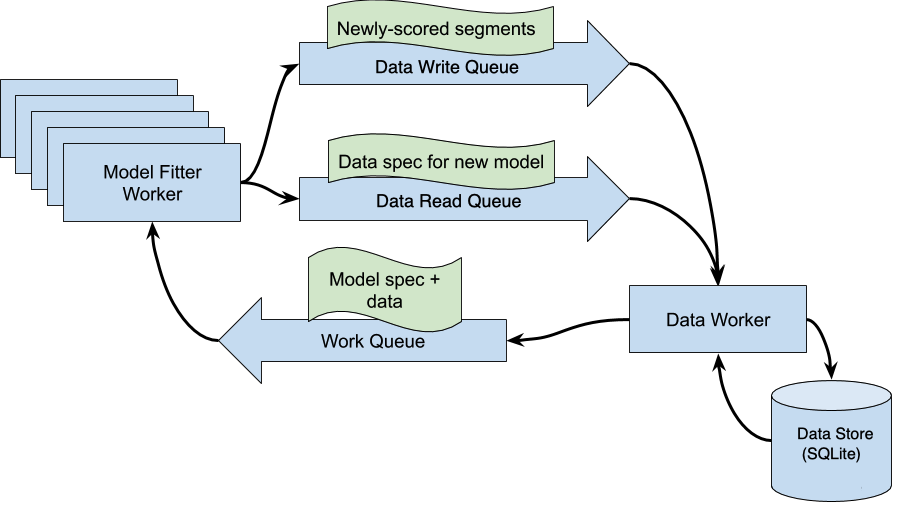

This code produces an example of the classification method described in *my paper*. It performs an iterative classification algorithm, either using the ordinal or naive methods described in the paper.

# Quickstart

Create a conda environment from the included package list:

conda create --name privacy_sensitive_active_learning --file conda-package-list.txt

Activate the environment:

conda activate privacy_sensitive_active_learning

Run either the ordinal or the naive classifier:

python -m privacy_sensitive_active_learning ordinal

**OR**

python -m privacy_sensitive_active_learning naive


# Included files
```
.
├── conda-package-list.txt    -- conda setup config 
├── config_file.yaml          -- runtime settings including # interations, sample size, etc.
├── how_simulation_works.png  -- program flow infographic
├── privacy_sensitive_active_learning
│   ├── config.py     -- loads configuration from the YAML file
│   ├── data.py       -- manages the DataStore class which interacts with the DB
│   ├── db.py         -- db access method
│   ├── __main__.py   -- program main method
│   ├── model.py      -- classes to perform operations using either the ordinal or naive model types
│   ├── process.py    -- runs queues and creates multiprocess workers
│   └── util.py       -- support methods
└── README.md         -- this file
```

# Logic Flow



1. The data store object is initialized 
 + (The Datastore exists to provide a single-core interface to the SQLite db, which generally does not support concurrent writes.)
 + It will look for a source data file on disk. If not found, it will download a copy of the mnist_784 dataset from [OpenML](https://www.openml.org). 
 + The data is read and shuffled.
 + A fresh SQLite database is created with a single empty table.

2. A "work" queue and "data read" queue are instantiated.

3. A "data write" queue is instantiated and populated with random samples drawn from the loaded MNIST dataset.

4. Data worker processes are initialized. They loop for the duration of their lives, in which:
 + It looks for an item on the write queue and if it finds one, adds it to the database
 + It looks for a data read request. If one is found, (*e.g.* "digit 3, generation 2") then relevant training data is pulled from the database, wrapped in a JobSpec and added to the database

5. Initial JobSpecs processes are added to the queue to seed the model building process.

6. Fitter processes are run. Each fitter worker runs in a loop in which
 + A jobspec is drawn from the work queue
 + The jobspec and its data is fed into the modeling algorithm which fits and then scores the whole training set
 + Among the scored data, top-scoring observations are selected as "segments"
 + Segments are then added to the write queue for reinsertion into the database
 + If more generations of a model remain, the next generation is added to the read queue for the data worker to read and transform into a jobspec, so that a future fitter worker may pick it up.

7. Once the required number of generations has been fit, the workers will loop with no work to do until their TTLs run out, at which point the processes will be "joined" and terminated. 

8. An evaluator is run, which trains a multinomial classifier from the predicted data. Final performance metrics are reported.
